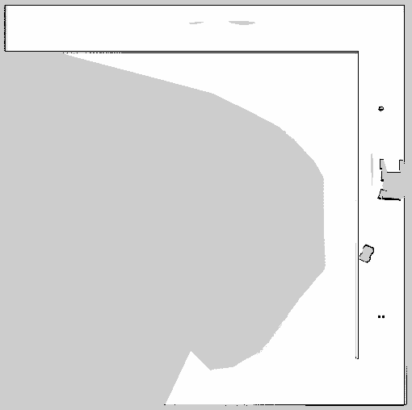

# Mapping

## Dependencies
* SLAM requirements(Refer to different documents based on the method you choose.)
  * [Fast-lio](https://github.com/hku-mars/FAST_LIO)
  * [Cartographer](https://google-cartographer-ros.readthedocs.io/en/latest/)
  * GMapping (should be available by default in the project)

## Usage

### 0. Gazebo World

This command will launch the gazebo with the project world

```bash
# Launch Gazebo World together with our robot
roslaunch me5413_world world.launch
```

### 1. Mapping

After launching **Step 0**, in the second terminal:

```bash
# Launch GMapping
roslaunch me5413_world mapping.launch

# or launch Cartographer 2D
roslaunch final_slam cartographer_2d.launch

# or launch Cartographer 3D
roslaunch final_slam cartographer_3d.launch

# or launch Fast-lio
roslaunch final_slam fast_lio.launch
```

After finishing GMapping and Cartographer mapping, run the following command in the thrid terminal to save the map:

```bash
# Save the map as `my_map` in the `maps/` folder
roscd final_slam/maps/
rosrun map_server map_saver -f my_map map:=/map
```

Saving maps with Fast-lio is relatively complex; please refer to [Fast-lio](https://github.com/hku-mars/FAST_LIO) for guidance.
Finally, the map we used is shown below.

